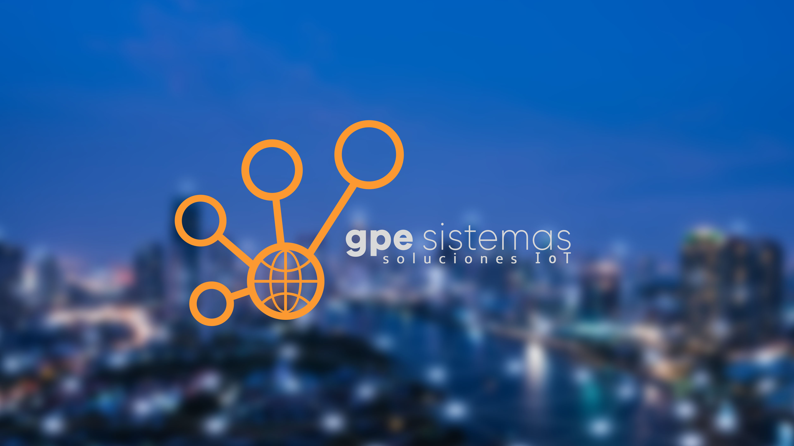

## Quiénes somos

GPE Sistemas es una empresa Argentina de Ingeniería especializada en soluciones de Telemetría E2E, desde el desarrollo de los dispositivos electrónicos hasta la Plataforma Cloud de gestión de datos bajo el concepto de Internet de las Cosas.

Instalada en la ciudad de Chascomús y creada en 2016 con capital propio, sus socios cuentan con más de 15 años de trayectoria en proyectos de Tecnología en ámbitos Privados y de Gobierno.

Actualmente, con productos certificados por INTI y Bureau Veritas, ofrecemos un porfolio de dispositivos y aplicaciones de Medición, Monitoreo y Trazabilidad utilizando tecnologías como LoRa, 4G, NBIOT, BLE o WIFI, que combinadas con sensores Industriales, Actuadores y nuestra Plataforma de software permiten transformar la red en una fuente sensible de información y en unos de los activos más importantes de cualquier Administración.

El diseño y desarrollo de nuestros dispositivos desde la Electrónica, el Firmware y la integración a gran variedad de Sensores, nos permite disponer de soluciones modulares y a medida imposibles de conseguir utilizando la electrónica comercial.

